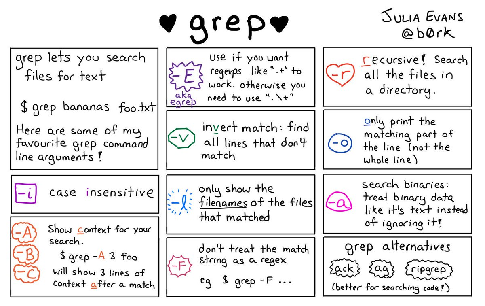
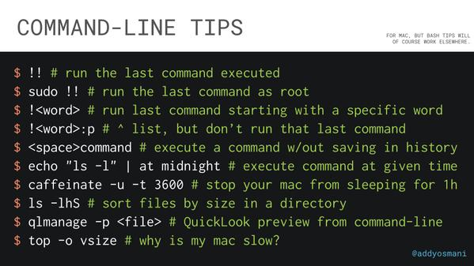

# You Don't Need GUI

[](https://spectrum.chat/you-dont-need/GUI)

<details>
It's for noobs :)
</details>
<br />

Graphical user interfaces are super friendly to computer users. They were introduced in reaction to the perceived steep learning curve of command-line interfaces (CLIs).


However, they often require more resources, are less powerful and hard to automate via scripting.

As a computer expert, we want to be more efficient and do our jobs better. We know that command words may not be easily discoverable or mnemonic, so we try to list some common tasks that you might be tempted to do in GUI.

## Quick links

1. [copy a file](#copy-a-file)
1. [duplicate a file](#duplicate-a-file)
1. [copy a directory](#copy-a-directory)
1. [duplicate a directory](#duplicate-a-directory)
1. [move a file](#move-a-file)
1. [rename a file](#rename-a-file)
1. [move a directory](#move-a-directory)
1. [rename a directory](#rename-a-directory)
1. [merge directories](#merge-directories)
1. [create a new file](#create-a-new-file)
1. [create a new directory](#create-a-new-directory)
1. [show file/directory size](#show-filedirectory-size)
1. [show file/directory info](#show-filedirectory-info)
1. [open a file with the default program](#open-a-file-with-the-default-program)
1. [zip a directory](#zip-a-directory)
1. [unzip a directory](#unzip-a-directory)
1. [peek files in a zip file](#peek-files-in-a-zip-file)
1. [remove a file](#remove-a-file)
1. [remove a directory](#remove-a-directory)
1. [list directory contents](#list-directory-contents)
1. [tree view a directory and its subdirectories](#tree-view-a-directory-and-its-subdirectories)
1. [find a stale file](#find-a-stale-file)
1. [show a calendar](#show-a-calendar)
1. [find a future date](#find-a-future-date)
1. [use a calculator](#use-a-calculator)
1. [force quit a program](#force-quit-a-program)
1. [check server response](#check-server-response)
1. [view content of a file](#view-content-of-a-file)
1. [search for a text](#search-for-a-text)
1. [view an image](#view-an-image)
1. [show disk size](#show-disk-size)
1. [check performance of your computer](#check-performance-of-your-computer)
1. [Quick tips](#quick-tips)
1. [Hotkeys](#hotkeys)
1. [I can't remember these cryptic commands](#i-cant-remember-these-cryptic-commands)


## copy a file

**STOP DRAG AND DROPPING A FILE, OR CMD/CTRL + C, CMD/CTRL + V A FILE** :-1:

Copy `readme.txt` to the `documents` directory

```shell
$ cp readme.txt documents/
```

## duplicate a file

**STOP RIGHT CLICKING AND DUPLICATE A FILE** :-1:

```shell
$ cp readme.txt readme.bak.txt
```
More advanced:
```shell
$ cp readme{,.bak}.txt
# Note: learn how the {} works with touch foo{1,2,3}.txt and see what happens.
```

## copy a directory

**STOP DRAG AND DROPPING A DIRECTORY, OR CMD/CTRL + C, CMD/CTRL + V A DIRECTORY** :-1:

Copy `myMusic` directory to the `myMedia` directory

```shell
$ cp -a myMusic myMedia/
# or
$ cp -a myMusic/ myMedia/myMusic/
```

## duplicate a directory

**STOP RIGHT CLICKING AND DUPLICATE A DIRECTORY** :-1:

```shell
$ cp -a myMusic/ myMedia/
# or if `myMedia` folder doesn't exist
$ cp -a myMusic myMedia/
```

## move a file

**STOP DRAG AND DROPPING A FILE, OR CMD/CTRL + X, CMD/CTRL + V A FILE** :-1:

```shell
$ mv readme.txt documents/
```

**Always** use a trailing slash when moving files, [for this reason](http://unix.stackexchange.com/a/50533).

## rename a file

**STOP RIGHT CLICKING AND RENAME A FILE** :-1:

```shell
$ mv readme.txt README.md
```

## move a directory

**STOP DRAG AND DROPPING A DIRECTORY, OR CMD/CTRL + X, CMD/CTRL + V A DIRECTORY** :-1:

```shell
$ mv myMedia myMusic/
# or
$ mv myMedia/ myMusic/myMedia
```

## rename a directory

**STOP RIGHT CLICKING AND RENAME A DIRECTORY** :-1:

```shell
$ mv myMedia/ myMusic/
```

## merge directories

**STOP DRAG AND DROPPING TO MERGE DIRECTORIES** :-1:

```shell
$ rsync -a /images/ /images2/	# note: may over-write files with the same name, so be careful!
```

## create a new file

**STOP RIGHT CLICKING AND CREATE A NEW FILE** :-1:

```shell
$ touch 'new file'    # updates the file's access and modification timestamp if it already exists
# or
$ > 'new file'        # note: erases the content if it already exists
```

## create a new directory

**STOP RIGHT CLICKING AND CREATE A NEW DIRECTORY** :-1:

```shell
$ mkdir 'untitled folder'
# or
$ mkdir -p 'path/may/not/exist/untitled folder'
```

## show file/directory size

**STOP RIGHT CLICKING AND SHOW FILE/directory INFO** :-1:

```shell
$ du -sh node_modules/
```

## show file/directory info

**STOP RIGHT CLICKING AND SHOW FILE/DIRECTORY INFO** :-1:

```shell
$ stat -x readme.md   # on macOS
$ stat readme.md      # on Linux
```

## open a file with the default program

**STOP DOUBLE CLICKING ON A FILE** :-1:

```shell
$ xdg-open file   # on Linux
$ open file       # on MacOS
```

## zip a directory

**STOP RIGHT CLICKING AND COMPRESS DIRECTORY** :-1:

```shell
$ zip -r archive_name.zip folder_to_compress
```

## unzip a directory

**STOP RIGHT CLICKING AND UNCOMPRESS DIRECTORY** :-1:

```shell
$ unzip archive_name.zip
```

## peek files in a zip file

**STOP USING WinRAR** :-1:

```shell
$ zipinfo archive_name.zip
# or
$ unzip -l archive_name.zip
```

## remove a file

**STOP RIGHT CLICKING AND DELETE A FILE PERMANENTLY** :-1:

```shell
$ rm my_useless_file
```

IMPORTANT: The rm command deletes my_useless_file permanently, which is equivalent to move my_useless_file to Recycle Bin and hit Empty Recycle Bin.

## remove a directory

**STOP RIGHT CLICKING AND DELETE A DIRECTORY PERMANENTLY** :-1:

```shell
$ rm -r my_useless_folder
```

## list directory contents

**STOP OPENING YOUR FINDER OR FILE EXPLORER** :-1:

```shell
$ ls my_folder        # Simple
$ ls -la my_folder    # -l: show in list format. -a: show all files, including hidden. -la combines those options.
$ ls -alrth my_folder # -r: reverse output. -t: sort by time (modified). -h: output human-readable sizes.
```

## tree view a directory and its subdirectories

**STOP OPENING YOUR FINDER OR FILE EXPLORER** :-1:

```shell
$ tree                                                        # on Linux
$ find . -print | sed -e 's;[^/]*/;|____;g;s;____|; |;g'      # on MacOS
# Note: install homebrew (https://brew.sh) to be able to use (some) Linux utilities such as tree.
# brew install tree
```

## find a stale file

**STOP USING YOUR FILE EXPLORER TO FIND A FILE** :-1:

Find all files modified more than 5 days ago

```shell
$ find my_folder -mtime +5
```

## show a calendar

**STOP LOOKING UP WHAT THIS MONTH LOOKS LIKE BY CALENDAR WIDGETS** :-1:

Display a text calendar

```shell
$ cal
```
Display selected month and year calendar

```shell
$ cal 11 2018
```

## find a future date

**STOP USING WEBAPPS TO CALCULATE FUTURE DATES** :-1:

What is todays date?

```shell
$ date +%m/%d/%Y
```

What about a week from now?

```shell
$ date -d "+7 days"                                           # on Linux
$ date -j -v+7d                                               # on MacOS
```

## use a calculator

**STOP USING CALCULATOR WIDGET** :-1:

```shell
$ bc
```

## force quit a program

**STOP CTRL + ALT + DELETE and choose the program to kill** :-1:

```shell
$ killall program_name
```

## check server response

**STOP OPENING A BROWSER** :-1:

```shell
curl -i umair.surge.sh
# curl's -i (--include) option includes HTTP response headers in its output.
```

## view content of a file

**STOP DOUBLE CLICKING A FILE** :-1:

```shell
$ cat apps/settings.py
# if the file is too big to fit on one page, you can use a 'pager' (less) which shows you one page at a time.
$ less apps/settings.py
```

## search for a text

**STOP CMD/CTRL + F IN A DIRECTORY** :-1:

```shell
$ grep -i "Query" file.txt
```



## view an image

**STOP USING PREVIEW** :-1:

```shell
$ imgcat image.png
# Note: requires iTerm2 terminal.
```

## show disk size

**STOP RIGHT CLICKING DISK ICON OR OPENING DISK UTILITY** :-1:

```shell
$ df -h
```

## check performance of your computer

**STOP OPENING YOUR ACTIVITY MONITOR OR TASK MANAGER** :-1:

```shell
$ top
```

## Quick tips



## Hotkeys

```
Ctrl + A  Go to the beginning of the line you are currently typing on
Ctrl + E  Go to the end of the line you are currently typing on
Ctrl + L  Clears the Screen, similar to the clear command
Ctrl + U  Clears the line before the cursor position. If you are at the end of the line, clears the entire line.
Ctrl + H  Same as backspace
Ctrl + R  Lets you search through previously used commands
Ctrl + C  Kill whatever you are running
Ctrl + D  Exit the current shell
Ctrl + Z  Puts whatever you are running into a suspended background process. fg restores it.
Ctrl + W  Delete the word before the cursor
Ctrl + K  Clear the line after the cursor
Ctrl + T  Swap the last two characters before the cursor
Esc + T   Swap the last two words before the cursor
Alt + F   Move cursor forward one word on the current line
Alt + B   Move cursor backward one word on the current line
Tab       Auto-complete files and directory names
```

## I can't remember these cryptic commands

You can always google or `man` the commands you are not familiar with. Or, checkout [tldr](https://github.com/tldr-pages/tldr), a collection of simplified and community-driven man pages.
