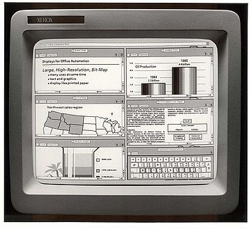

# You Don't Need GUI

<details>
It's for noobs :)
</details>

Graphical user interfaces are super friendly to computer users. They were introduced in reaction to the perceived steep learning curve of command-line interfaces (CLIs).



However, they often require more resources, are less powerful and hard to automate via scripting.

As a computer expert, we want to be more efficient and do our jobs better. We know that command words may not be easily discoverable or mnemonic, so we try to list some common tasks that you might tempt to do in GUI.

## Quick links

1. [copy a file](#copyfile)
1. [duplicate a file](#duplicatefile)
1. [copy a folder](#copyfolder)
1. [duplicate a folder](#duplicatefolder)
1. [move a file](#movefile)
1. [rename a file](#renamefile)
1. [move a folder](#movefolder)
1. [new file](#newfile)
1. [new folder](#newfolder)
1. [file/folder size](#filesize)
1. [open a file with default program](#opendefault)
1. [zip a folder](#zipfolder)
1. [unzip](#unzip)
1. [remove a file](#removefile)
1. [remove a folder](#removefolder)
1. [list folder contents](#listfolder)
1. [find a stale file](#findfile)
1. [show a calendar](#showcal)
1. [calculate next week](#calcweek)


## <a id="copyfile"></a>copy a file

**STOP DRAG AND DROP A FILE, OR CMD/CTRL + C, CMD/CTRL + V A FILE**

Copy `readme.txt` to the `documents` folder

```
cp readme.txt documents
```

## <a id="duplicatefile"></a>duplicate a file

**STOP RIGHT CLICK AND DUPLICATE FILE**

If `readme.bak.txt` file doesn't exist

```
cp readme.txt readme.bak.txt
```

## <a id="copyfolder"></a>copy a folder

**STOP DRAG AND DROP A FOLDER, OR CMD/CTRL + C, CMD/CTRL + V A FOLDER**

Copy `myMusic` folder under `myMedia` folder

```
cp -a myMusic myMedia
```

## <a id="duplicatefolder"></a>duplicate a folder

**STOP RIGHT CLICK AND DUPLICATE FOLDER**

If `myMedia` folder doesn't exist

```
cp -a myMusic myMedia
```

## <a id="movefile"></a>move a file

**STOP DRAG AND DROP A FILE, OR CTRL + X, CTRL + V A FILE**

```
mv readme.txt documents
```

## <a id="renamefile"></a>rename a file

**STOP RIGHT CLICK AND RENAME A FILE**

```
mv readme.txt README.md
```

## <a id="movefolder"></a>move a folder

**STOP DRAG AND DROP A FOLDER, OR CTRL + X, CTRL + V A FOLDER**

```
mv myMedia myMusic
```

## <a id="newfile"></a>new file

**STOP RIGHT CLICK AND CREATE A NEW FILE**

```
touch 'new file'
```

## <a id="newfolder"></a>new folder

**STOP RIGHT CLICK AND CREATE A NEW FOLDER**

```
mkdir 'untitled folder'
```

or

```
mkdir -p 'path/may/not/exist/untitled folder'
```

## <a id="filesize"></a>file/folder size

**STOP RIGHT CLICK AND SHOW FILE/FOLDER INFO**

```
stat -x readme.md
```

or

```
du -sh readme.md
```

## <a id="opendefault"></a>open a file with default program

**STOP DOUBLE CLICKING A FILE**

```
open file       # on macOS
xdg-open file   # on Linux
```

## <a id="zipfolder"></a>zip a folder

**STOP RIGHT CLICK AND COMPRESS FOLDER**

```
zip -r archive_name.zip folder_to_compress
```

## <a id="unzip"></a>unzip

**STOP RIGHT CLICK AND UNCOMPRESS FOLDER**

```
unzip archive_name.zip
```

## <a id="removefile"></a>remove a file

**STOP RIGHT CLICK AND DELETE FILE OR DRAG IT TO RECYCLE**

```
rm my_useless_file
```

## <a id="removefolder"></a>remove a folder

**STOP RIGHT CLICK AND DELETE FOLDER OR DRAG IT TO RECYCLE**

```
rm -r my_useless_folder
```

## <a id="listfolder"></a>list folder contents

**STOP OPENING YOUR FINDER OR FILE EXPLORER**

```
ls -la my_folder
```

## <a id="findfile"></a>find a stale file

**STOP USING YOUR FILE EXPLORER TO FIND A FILE**

Find all files modified more than 5 days ago

```bash
find my_folder -mtime +5
```

## <a id="showcal"></a>show a calendar

**STOP LOOKING UP THIS MONTH BY CALENDAR WIDGETS**

Display a text calendar

```
cal
```

## <a id="calcweek"></a>calculate next week

**STOP USING WEBAPPS TO CALCULATE FUTURE DATES**

What is today?

```
date +%m/%d/%Y
```

And what is next week?

```
date -d "+1 week"
```

---

_Remember, you can always google or `man` the commands you are not familiar with._
